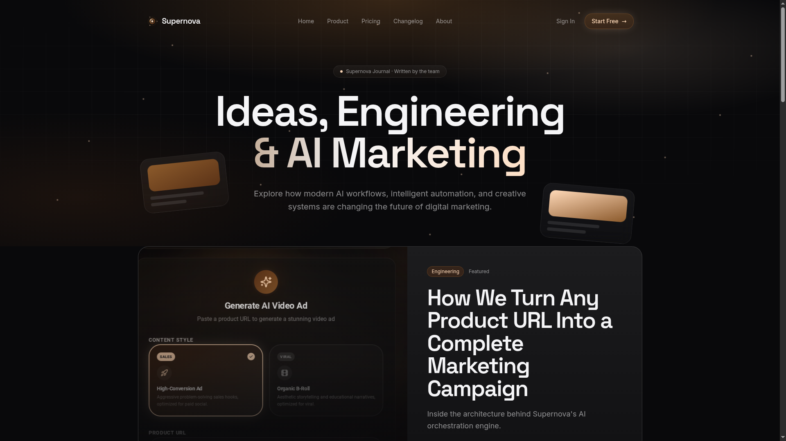

<div align="center">

# 

# Supernova Journal

**Engineering blog documenting the development, architecture, AI experiments, technical decisions, and product journey behind Supernova.**

<br />


<br />

<!-- GitHub Readme Typing SVG -->
<p align="center">
  
</p>

</div>

---

## 📖 About

Welcome to the **Supernova Journal** — the official engineering blog documenting the complete development journey of the Supernova AI Marketing Platform.

### Topics We Cover

- 🧠 **AI Architecture** — Multi-model orchestration, GenBlaze engine, AI routing
- ⚙️ **Engineering Logs** — Development progress, weekly updates, technical deep dives
- 🏗️ **System Design** — Scalable architecture, API design, database patterns
- ☁️ **Backblaze Integration** — B2 storage implementation, lifecycle policies, CDN
- 🤖 **GenBlaze Development** — AI workflow orchestration, model routing, cost optimization
- 🚀 **Product Updates** — New features, improvements, changelog entries
- 📈 **Performance** — Optimization techniques, caching strategies, latency reduction
- 📚 **Technical Articles** — In-depth explorations of complex engineering topics
- 🔍 **Debugging Stories** — Real-world problem solving, lessons learned
- 💡 **Development Insights** — Architecture decisions, design patterns, best practices

---

## 📸 Preview



---

## 🌐 Explore Supernova

| Link | Description |
|------|-------------|
| 📖 **Engineering Journal** | [https://journal-supernova.vercel.app/](https://journal-supernova.vercel.app/) |
| 🚀 **Main Application** | [https://appsupernova.vercel.app/auth](https://appsupernova.vercel.app/auth) |
| 🌐 **Landing Website** | [https://landing-supernova.vercel.app/](https://landing-supernova.vercel.app/) |
| 🎤 **Pitch Deck** | [https://pitch-deck-supernova.vercel.app/](https://pitch-deck-supernova.vercel.app/) |
| 🐙 **Main Repository** | [https://github.com/robloxsagax-web/Supernova](https://github.com/robloxsagax-web/Supernova) |

---

## 📚 Content Categories

<div align="center">

| Category | Description |
|----------|-------------|
| 🧠 **AI Research** | Exploring multi-model AI orchestration and intelligent routing |
| ⚙️ **Engineering Logs** | Weekly development updates and technical progress |
| 🏗️ **Architecture** | System design, scalability, and infrastructure |
| ☁️ **Backblaze Integration** | B2 storage, lifecycle management, CDN strategy |
| 🤖 **GenBlaze Development** | AI workflow engine and model orchestration |
| 🚀 **Product Updates** | New features, improvements, and releases |
| 📈 **Performance** | Optimization, caching, and latency reduction |
| 📚 **Technical Articles** | Deep dives into complex engineering topics |
| 🔍 **Debugging Stories** | Real problem-solving and troubleshooting |
| 💡 **Development Insights** | Architecture decisions and best practices |

</div>

---

## 🛠 Technology Stack

### Frontend

| Technology | Purpose |
|------------|---------|
| **Next.js** | React framework with SSR/SSG |
| **React 19** | Latest React with concurrent features |
| **TypeScript** | Type-safe development |
| **Tailwind CSS v4** | Utility-first styling |
| **Radix UI** | Accessible UI primitives |

### Content

| Technology | Purpose |
|------------|---------|
| **Editorial Design** | Premium reading experience |
| **Responsive Layout** | Mobile-first approach |

### Deployment

| Technology | Purpose |
|------------|---------|
| **Vercel** | Edge deployment and CDN |

---

## 💭 Why This Exists

Transparency and documentation are fundamental to building great software. The Supernova Journal exists to:

- **Document decisions** — Record the reasoning behind architectural choices
- **Share experiments** — Share AI experiments, results, and learnings
- **Explain architecture** — Make complex systems understandable
- **Celebrate failures** — Share debugging stories and lessons learned
- **Track evolution** — Show how the product has grown over time
- **Build community** — Connect with developers interested in AI marketing

This journal accompanies the Supernova platform, providing insight into how a production AI system is built from concept to deployment.

---

## 📁 Project Structure

```
supernova-journal/
├── public/
│   ├── favicon.ico
│   ├── favicon.svg
│   ├── logo.png
│   ├── journal.png
│   └── Screenshot 2026-07-20 *.png   # Article cover images
├── src/
│   ├── components/
│   │   ├── branding/                 # SupernovaLogo
│   │   │   ├── SupernovaLogo.tsx
│   │   │   └── index.ts
│   │   ├── ArticleCard.tsx           # Blog card component
│   │   ├── Diagram.tsx               # Flow diagram component
│   │   ├── Footer.tsx                # Site footer
│   │   ├── Nav.tsx                   # Navigation header
│   │   ├── StubPage.tsx              # Placeholder pages
│   │   └── ui/                       # shadcn/ui components
│   ├── data/
│   │   └── articles.ts               # Article content & metadata
│   ├── lib/
│   │   ├── utils.ts                  # Utility functions
│   │   ├── constants.ts               # App constants
│   │   ├── error-capture.ts          # Error handling
│   │   ├── error-page.ts             # Error page template
│   │   └── lovable-error-reporting.ts
│   ├── routes/
│   │   ├── __root.tsx                # Root layout
│   │   ├── index.tsx                 # Blog homepage
│   │   ├── blog.$slug.tsx            # Article detail page
│   │   ├── changelog.tsx             # Product changelog
│   │   ├── about.tsx                 # About page (stub)
│   │   ├── pricing.tsx               # Pricing page (stub)
│   │   └── product.tsx               # Product page (stub)
│   ├── router.tsx                    # TanStack Router config
│   ├── routeTree.gen.ts              # Auto-generated routes
│   ├── server.ts                     # SSR server entry
│   ├── start.ts                     # Middleware setup
│   └── styles.css                    # Custom styles
├── LICENSE
├── package.json
├── tsconfig.json
├── vite.config.ts
├── components.json
└── README.md
```

---

## 🏆 Built for the Backblaze × GenBlaze Hackathon 2026

This engineering journal accompanies the Supernova platform and documents the complete development journey from concept to production. It showcases:

- **AI orchestration** powered by GenBlaze
- **Storage infrastructure** built on Backblaze B2
- **Production-ready architecture** designed for scale
- **Engineering transparency** through public documentation

The journal provides judges and the community with insight into how Supernova was built, the decisions made along the way, and the technical challenges overcome.

---

## 🔗 Related Projects

| Project | Description | Live |
|---------|-------------|------|
| Supernova Platform | AI Marketing Platform | [Visit](https://appsupernova.vercel.app/auth) |
| Landing Website | Marketing Website | [Visit](https://landing-supernova.vercel.app/) |
| Engineering Journal | Development Blog | [Visit](https://journal-supernova.vercel.app/) |
| Pitch Deck | Official Presentation | [Visit](https://pitch-deck-supernova.vercel.app/) |

**Main Repository:** [https://github.com/robloxsagax-web/Supernova](https://github.com/robloxsagax-web/Supernova)

---

## 📜 License

This project is licensed under the MIT License — see the [LICENSE](LICENSE) file for details.

---

<div align="center">

## Made with ❤️ while building Supernova.

**Powered by**

[](https://nextjs.org/)
[](https://react.dev)
[](https://www.typescriptlang.org)
[](https://vercel.com)

**Designed and developed by [Muhammad Mujtaba Ismail](https://github.com/robloxsagax-web)**

</div>
